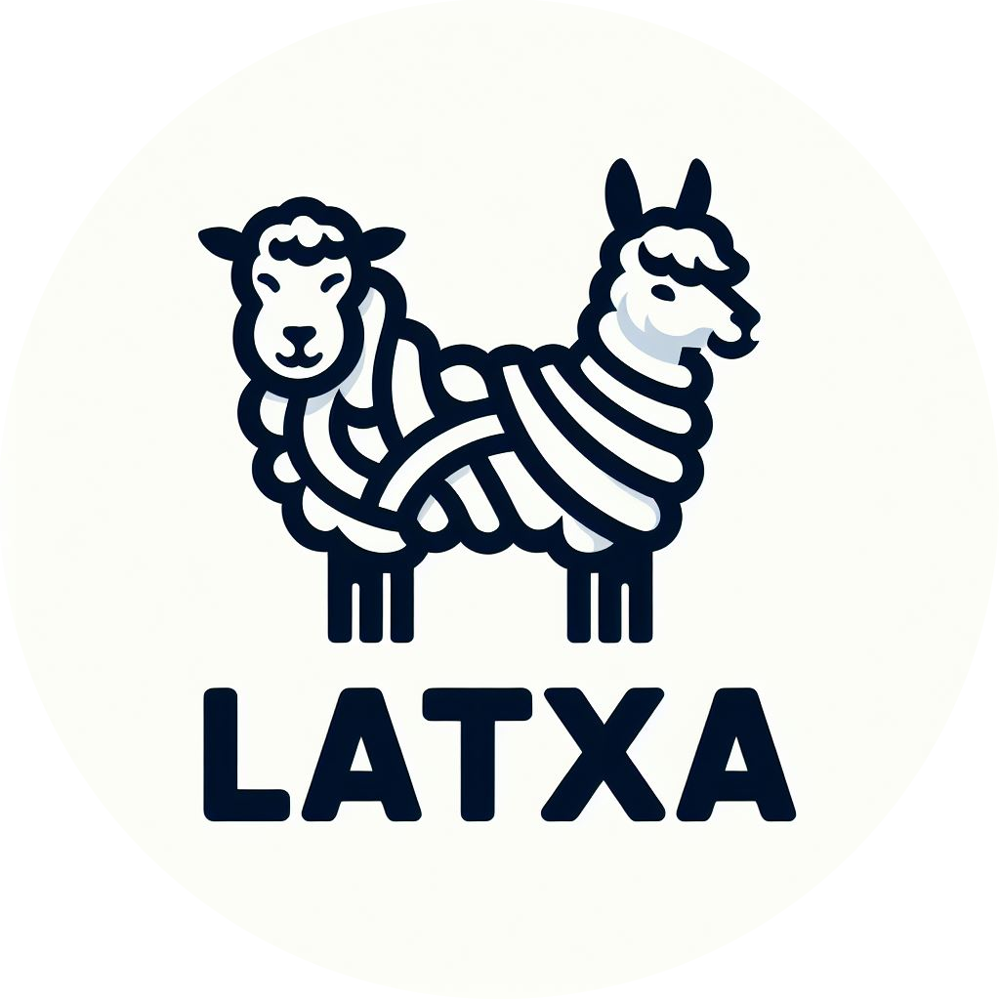

<p align="center">
    <br>
    
    <br>
    <h1 align="center">Latxa: An Open Language Model and Evaluation Suite for Basque</h1>


<p align="center">
    <a href="https://github.com/hitz-zentroa/latxa/blob/main/LICENSE"></a>
    <a href="https://huggingface.co/collections/HiTZ/latxa-65a697e6838b3acc53677304"></a>
    <a href="https://www.hitz.eus/en/node/340"></a>
    <a href="https://openreview.net/forum?id=mMqOvfqFS9"></a>
<br>
     <a href="http://www.hitz.eus/"></a>
    <a href="http://www.ixa.eus/?language=en"></a>
    <br>
     <br>
</p>

<p align="justify">
We introduce  Latxa, a family of large language models for Basque ranging from 7 to 70 billion parameters. Latxa is based on Llama 2, which we continue pretraining on a new Basque corpus comprising 4.3M documents and 4.2B tokens. Addressing the scarcity of high-quality benchmarks for Basque, we further introduce 4 multiple choice evaluation datasets: EusProficiency, comprising 5,169 questions from official language proficiency exams; EusReading, comprising 352 reading comprehension questions; EusTrivia, comprising 1,715 trivia questions from 5 knowledge areas; and EusExams, comprising 16,046 questions from public examinations. In our extensive evaluation, Latxa outperforms all previous open models we compare to by a large margin. In addition, it is competitive with GPT-4 Turbo in language proficiency and understanding, despite lagging behind in reading comprehension and knowledge-intensive tasks. Both the Latxa family of models, as well as our new pretraining corpora and evaluation datasets, are publicly available under open licenses. Our suite enables reproducible research on methods to build LLMs for low-resource languages.

- 📒 Blog Post: [Latxa: An Open Language Model and Evaluation Suite for Basque](https://www.hitz.eus/en/node/340)
- 📖 Paper: [Latxa: An Open Language Model and Evaluation Suite for Basque](https://openreview.net/forum?id=mMqOvfqFS9)
-  Latxa in the 🤗HuggingFace Hub: [HiTZ/latxa](https://huggingface.co/collections/HiTZ/latxa-65a697e6838b3acc53677304)
</p>

# Training

Code for training models on the Leonardo cluster. This uses GPT-Neox and Megatron for more efficient training.

## Install GPT-Neox

Install modules needed for GPT-Neox. You can add this to `.bashrc` so that modules are loaded automatically:

```bash
module load profile/deeplrn
module load python/3.10.8--gcc--11.3.0
module load cuda/11.8
module load openmpi/4.1.4--gcc--11.3.0-cuda-11.8
module load zlib/1.2.13--gcc--11.3.0
module load git-lfs
```

Clone the repository and checkout the `llemma` branch:

```bash
git clone https://github.com/EleutherAI/gpt-neox
cd gpt-neox
git checkout llemma
```

Create a virtual environment:

```bash
python -m venv venv
```

Activate the virtual environment. You can add this to `.bashrc` so that the virtual environment is activated automatically:

```bash
source venv/bin/activate
```

Comment `flash-attn` and `fused-kernels` from `requirements.txt` to avoid errors:

Remove also `torch==2.0.1` to install only the cuda version.

Install the requirements:

```bash
pip install -r requirements.txt
```

Install torch with: `pip install torch==2.0.1 --index-url https://download.pytorch.org/whl/cu118`

Install `flash-attn` and `fused-kernels`:
    
```bash
pip install flash-attn==2.0.6
pip install fused-kernels@file:///leonardo_work/EUHPC_E02_013/gpt-neox/megatron/fused_kernels
```

## Install DeeperSpeed

Install fixed DeepSpeed
```bash
git clone https://github.com/EleutherAI/DeeperSpeed
cd ${WORK}/DeeperSpeed
python -m pip install -e .
```

Add the `${WORK}` directory as safe directory
`git config --global --add safe.directory /leonardo_work/EUHPC_E02_013/gpt-neox`

Reinstall flash attention
```
pip uninstall flash-attn
cd flash-attention/
python setup.py install
```

## Download Llama Models

Download the raw Llama models from the following links:

Llama-2-7b: https://huggingface.co/meta-llama/Llama-2-7b

Llama-2-13b: https://huggingface.co/meta-llama/Llama-2-13b

Llama-2-70b: https://huggingface.co/meta-llama/Llama-2-70b

## Convert Checkpoints

Convert the raw Llama models to Neox format using scripts in `convert` directory. Note that the 70B model uses a different conversion script that takes into account the `n_kv_heads` parameter. Rename the script that in included when cloning the repo to match the name in `convert_raw_llama_weights_to_neox_70b.sh`. For the conversion script of the 7B and 13B models, get the script in the previous commit.

```bash
cd convert
bash convert_raw_llama_weights_to_neox_7b.sh
bash convert_raw_llama_weights_to_neox_13b.sh
bash convert_raw_llama_weights_to_neox_70b.sh
```

## Download Data

Download the pretraining data from the following links:

Euscrawl: https://huggingface.co/datasets/HiTZ/euscrawl

Pile: https://huggingface.co/datasets/EleutherAI/pile

Latxa v1.1: https://huggingface.co/datasets/HiTZ/latxa-corpus-v1.1

## Preprocess Data

Preprocess data using scripts available in `preprocess` directory:

To preprocess the Pile dataset, run `bash preprocess_data_pile.sh`.

To preprocess the Latxa v1 dataset, run `bash preprocess_data_latxa-v1.sh`.

To preprocess the Latxa v1.1 dataset, run `bash preprocess_data_latxa-v1.1.sh`.

## Define Configs

Define training configs in the `configs` directory. You can use the existing configs as a template.

## Setup Wandb

Change default wandb config directory:

```bash
export WANDB_CONFIG_DIR=$HOME/.wandb
```

Login to wandb:

```bash
wandb login
```

Change wandb to offline mode:

```bash
wandb offline
```

Logs with be saved to `$WORK/gpt-neox/wandb` directory.

To sync logs to wandb, run:

```bash
wandb sync $WORK/gpt-neox/wandb
```

## Run Training

Run training using scripts available in `train` directory:

```bash
cd train
bash llama-2-7b.sh
```

## Convert Neox Checkpoints to HF

The Neox checkpoints can be converted to HF using the `convert_llama_sequential_to_hf.py` and `convert_llama_gqa_sequential_to_hf.py` scripts. The `convert_llama_sequential_to_hf.py` script can be used to convert the 7B and 13B models. The `convert_llama_gqa_sequential_to_hf.py` script can be used to convert the 70B model. The scripts take an input path, the output path and the model config as arguments. You can find example scripts in the `convert` directory. For example, to convert the 7B model, run:

```bash
bash convert_llama_sequential_to_hf_7b.sh
```

# Evaluation

Evaluation scripts for open models are in the `scripts` directory. `openai` directory contains scripts for evaluating openai models. Evaluation results are in the `results` directory.

## Install Evaluation Harness

You will need to install our fork of [LM Evaluation Harness](https://github.com/EleutherAI/lm-evaluation-harness) for evaluation in the `evaluation` folder.

```bash	
git clone https://github.com/juletx/lm-evaluation-harness
cd lm-evaluation-harness
git checkout eustrivia
pip install -e .
```

## Run Open Model Evaluation

To run evaluation on open models, use the scripts in the `scripts` directory. For example, to run evaluation on Latxa v1.1 7b, run:

```bash
sbatch lm_eval_latxa-7b-v1.1.slurm
```

## Run OpenAI Model Evaluation

To run evaluation on OpenAI models, use the scripts in the `openai` directory. For example, to run evaluation on GPT-3.5 Turbo on EusTrivia, run:

```bash
bash gpt-3.5-turbo-0125_eus_trivia.sh
```